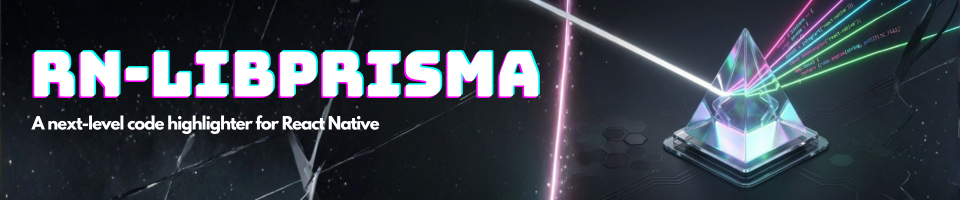

<div align="center">
  <a href="https://github.com/athexweb3/react-native-libprisma">
    <picture>
      
    </picture>
  </a>
</div>

# ⚡️ react-native-libprisma

High-performance syntax highlighting for React Native.

> Note: This library is currently in active development, porting to New Architecture, Bridgeless, and [`Nitro Modules`](https://github.com/mrousavy/react-native-nitro).

> Note: Minimum supported version of React Native is `0.75`.

## Features

Unlike other JS-based syntax highlighters, `react-native-libprisma` is powered by a C++ port of Prism.js using JSI, providing much greater performance - especially on mobile devices.

- 🏎️ **Blazing Fast** - C++ implementation with native performance via JSI
- ⚡️ **Zero Dependencies** - No dependencies on C++ or TypeScript layers
- 🧪 **200+ Languages** - Comprehensive language support out of the box
- 🎨 **11 Built-in Themes** - Beautiful, ready-to-use themes (Dracula, VS Code, etc.)
- 🔢 **TypeScript First** - Full type safety with autocomplete
- 🔁 **Cross Platform** - Works on iOS, Android, and macOS

## Versions

| Version | RN Architecture | Modules |
| ------- | ------ | ------- |
| `0.4.x +` | New / Bridgeless | Nitro Modules |
| `<= 0.3.x` | Old / New | Turbo Modules |

## Benchmarks

This library is significantly faster than JS-only alternatives because the tokenization happens in C++. See [Benchmarks](./docs/benchmark.md) for detailed comparisons.

---

## Installation

<h3>
  React Native  <a href="#"></a>
</h3>

```sh
bun add react-native-libprisma react-native-nitro-modules
cd ios && pod install
```

<h3>
  Expo  <a href="#"></a>
</h3>

```sh
npx expo install react-native-libprisma
npx expo prebuild
```

## Usage

### Basic Tokenization

```tsx
import { tokenize } from 'react-native-libprisma';

const code = `const greeting = "Hello, World!";`;
const tokens = tokenize(code, 'javascript');
```

### Rendering with Themes

```tsx
import { tokenize, themes } from 'react-native-libprisma';
import { Text } from 'react-native';

function CodeBlock() {
  const code = `console.log("Hello!");`;
  const tokens = tokenize(code, 'javascript');
  const theme = themes.draculaTheme;

  return (
    <Text>
      {tokens.map((token, i) => (
        <TokenDisplay key={i} token={token} theme={theme} />
      ))}
    </Text>
  );
}
```

## Themes

We include 11 popular themes out of the box:

```ts
import { themes } from 'react-native-libprisma';

themes.draculaTheme             // Dracula
themes.peaceOfEyeTheme          // Default Dark
themes.officialTheme            // VS Code Dark
themes.blueVelvetTheme          // Blue Velvet
themes.vintageTheme             // Vintage
themes.shadesOfGreyTheme        // Shades of Grey
themes.traditionalTheme         // Traditional
themes.professionalTheme        // Professional
themes.defaultColorTheme        // Default
themes.peaceOfEyeDraculaTheme   // Peace of Eye (Dracula variant)
themes.simpleAsLightTheme       // Light Theme
```

## Community Discord

[Join the Margelo Community Discord](https://discord.gg/6CSHz2qAvA) to chat about react-native-libprisma or other libraries.

## Contributing

See the [contributing guide](CONTRIBUTING.md) to learn how to contribute to the repository and the development workflow.

## License

- react-native-libprisma is licensed under MIT.
- This project builds upon the excellent work of [Telegram's libprisma](https://github.com/TelegramMessenger/libprisma) and [Prism.js](https://prismjs.com/).

---

<div align="center">
  <p>Built with ❤️ by <a href="https://github.com/athexweb3">Athex Web3</a></p>
</div>
